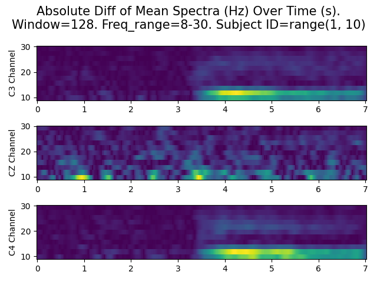
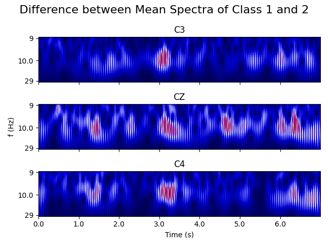
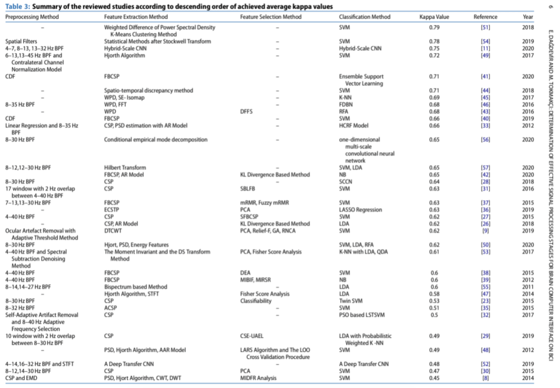

# Quick start
Run BPF_CWT_CaiT.py to do the following:
```
1. Bandpassfilter 8-30 Hz
2. Continuous Wavelet Transform with the morl Wavelet
3. Classify with CaiT 
```
Run STFT_CaiT.py to do the following:
```
1. STFT with win=512 and overlap=500 for high time and frequency resolution.
2. CaiT uses 5x5 patches to process 45x85 PSD's (PSD=spectra over time)
```
Run STFT_rectangular_CaiT.py to do the following:
```
1. STFT with win=128 and overlap=121 for high time and low frequency resolution.
2. Standardize the data to allow for better GD behavior
3. CaiT uses 11x11 patches to process 11x143 PSD's (PSD=spectra over time), i.e. time segments
```
# Experimental Results


| Method                | Accuracy (%) | 
|-----------------------|--------------|
| Best Team             | 80           | 
| Rectangular STFT CaiT | 77.60        | 
| STFT CaiT             | 76.38        |
| STFT AutoML with TPOT | 71           |
| ROCKET                | 69           |
| Wavelet CaiT          | 68           |


# Data Visualization




# TO DO
:green_circle: very important, :yellow_circle: important, :red_circle: not important right now

Based on implementation effort and how promising the idea is


- :green_circle: Reproducing the Results from the below table
- :yellow_circle: Learning schedule for faster and better results
- :red_circle: Brain float for trading accuracy with speed
- :red_circle: Torch DataLoader to load data faster

# Discussion List

- :green_circle: The table below
- :red_circle: AutoML was not satisfactory
- :red_circle: ROCKET, the best time series classifer, was very bad => we need time-frequency analysis for feature extraction
- :red_circle: Wavelet did not perform very well


# New Ideas
