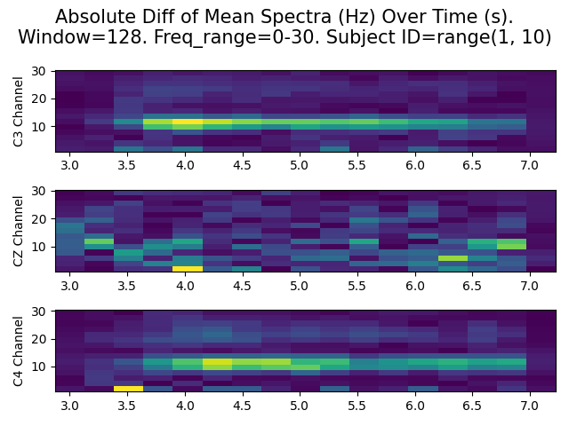

# Quick start
Run trainOne_testOne.py to do the following:
```
for s in all_subjects:
	train(ViT, s)
	test(s)
```
Run trainAll_testAll.py to do the following:
```
train(ViT, all_subjects)
test(all_subjects)
```

# Data Visualization


Using STFT to transform the data from all subjects interval-based into
the frequency domain, we can see that during the MI phase (4-7 seconds) there
is a clear difference in the mean spectra across all trials. However, this clear
difference is not always the case when looking at individual trials or individual
subjects

# Using the CaiT Visual Transformer on the data

| kappa | 1 | 2 | 3 | 4 | 5 | 6 | 7 | 8 | 9 |
| --- | --- | --- | --- | --- | --- | --- | --- | --- | --- |
| 0.39 | 0.22 | -0.05 | 0.09 | 0.88 | 0.63 | 0.21 | 0.41 | 0.62 | 0.48 |


# TO DO
:green_circle: very important, :yellow_circle: important, :red_circle: not important right now,
Based on implementation effort and how promising the idea is

- :green_circle: Discuss using CaiT instead of ViT with Omair
- :green_circle: Hyperparameter tuning
- :green_circle: Cutting Time and frequency axis to reduce variables with low predictive power
- :green_circle: Implement ROCKET and compare with CaiT
- :green_circle: Gain insights on what made different approaches more successful by looking at the winners papers in detail
- :yellow_circle: Learning schedule for faster and better results
- :yellow_circle: Sliding Window instead of whole MI
- :yellow_circle: Using other transformations on the raw data, e.g. Wavelet
- :yellow_circle: Normalizing/ Standardizing Data for better results
- :yellow_circle: Ensembling time and frequency. Or same model but trained on differently transformed data
- :red_circle: Brain float for trading accuracy with speed
- :red_circle: Torch DataLoader to load data faster

