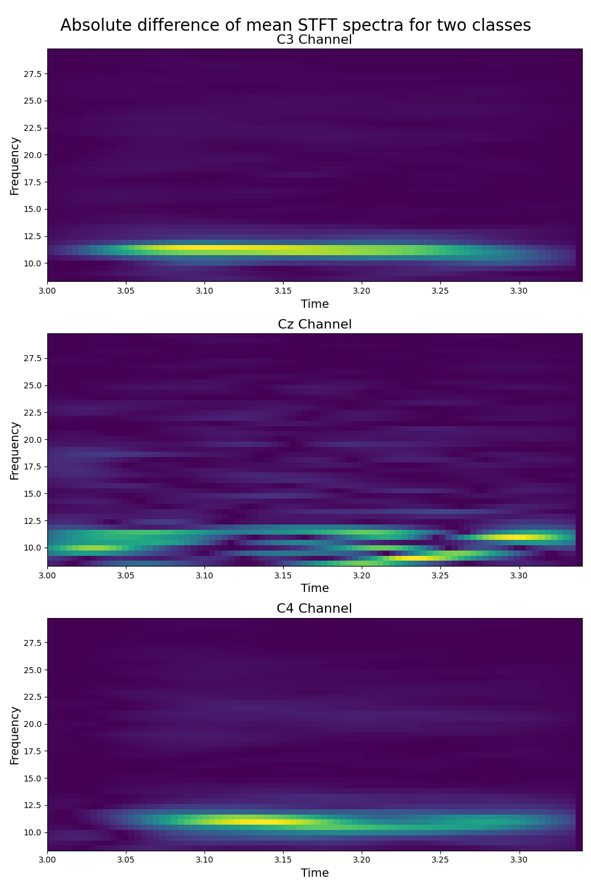
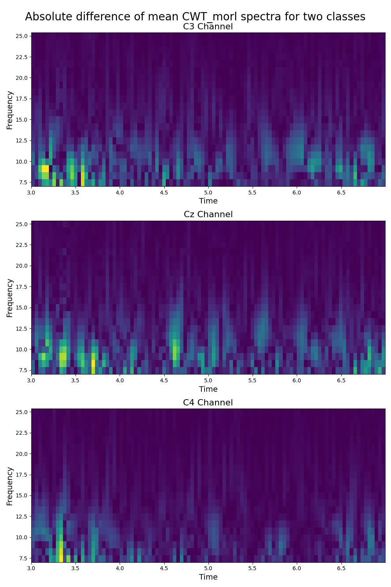
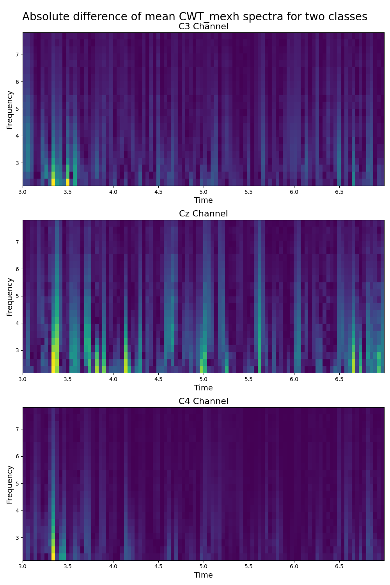

|                                                                              |                                                                                |                                                                                 |
|:----------------------------------------------------------------------------:|:------------------------------------------------------------------------------:|:-------------------------------------------------------------------------------:|
|             STFT 76%           |               HHT 69%             |        Stockwell 66%         |
|   Complex Morl Wavelet 71% |   Complex Gauss Wavelet 69% |   Complex Shannon Wavelet 71% |
|       Morl Wavelet 66%     |    Mexican Hat Wavelet 65%   |        Wigner_Ville       |

# Roadmap
This README serves to illustrate the progress in this project.

## 1. Rectangular Patches for CaiT :heavy_check_mark:
We have implemented rectangular patches for the CaiT architecture, which allows us to analyze how ViTs perform in the frequency domain.

## 2. Per Subject Test Accuracy :heavy_check_mark:

We have calculated the test accuracy for each subject, providing us with a granular understanding of how well our models perform on individual cases.

## 3. Grid Search :heavy_check_mark:

We have employed grid search to optimize hyperparameters for each feature extraction method, ensuring that we make accurate statements about the quality of extracted features.

## 4. Feature Extraction Methods

We will investigate various feature extraction methods, including:

-   4.1 Short-Time Fourier Transform (STFT) :heavy_check_mark:
    
    -   Parameters: window size, overlap
-   4.2 Hilbert-Huang Transform (HHT) :heavy_check_mark:
    
    -   Parameters: Density, Segment Size
-   4.3 Continuous Wavelet Transform (CWT) :heavy_check_mark:
    -   Parameters: wavelet function, Density, Segment Size
-   4.4 Stockwell Transform (S-Transform) :heavy_check_mark:
    
    -   Parameters: Density, Segment Size
-   4.5 (Optional) Wigner-Ville Distribution

    - Density, Segment Size
  
## 5. Ensemble Methods

After obtaining the best parameters for each transformation, we will explore ensemble methods to improve the performance of our models:

-   5.1 Weighted Voting
    -   Implement weighted voting based on the probability distribution of each class predicted by the ViT models.

## 6. Review and Future Steps

-   We will have a meeting to review the intermediate results and plan the next steps, which may include different ensembling methods or moving to the time domain.

